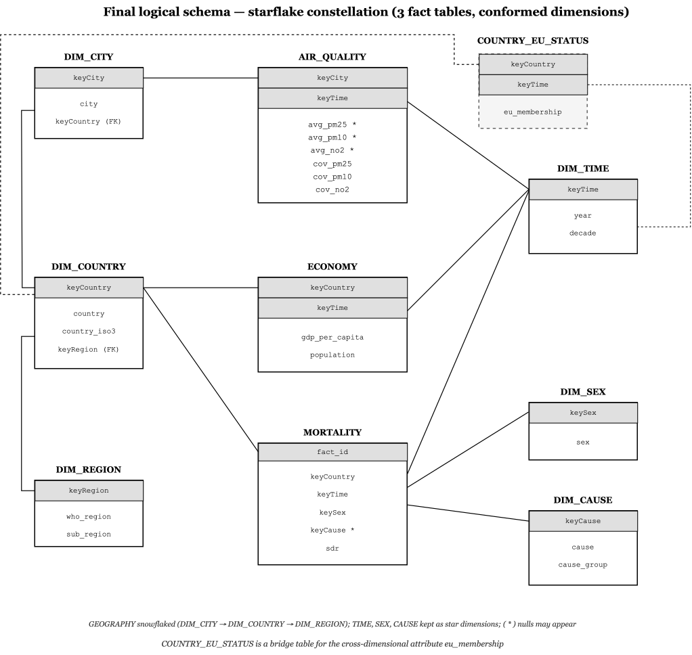

# European Environmental & Health Data Warehouse

A PostgreSQL data warehouse integrating **air quality**, **mortality** and **economic** indicators across European countries (2010–2020), built with a 3-tier ELT pipeline (staging → reconciled → data warehouse) and analyzed through ROLAP queries.


## Table of Contents

1. [Overview](#1-overview)
2. [Data Sources](#2-data-sources)
3. [Architecture](#3-architecture)
   - [3.1 Staging Layer](#31-staging-layer)
   - [3.2 Reconciled Layer](#32-reconciled-layer)
   - [3.3 Data Warehouse Layer](#33-data-warehouse-layer)
4. [Dimensional Model](#4-dimensional-model)
   - [4.1 Dimensions](#41-dimensions)
   - [4.2 Fact Tables](#42-fact-tables)
5. [Data Quality & Reject Log](#5-data-quality--reject-log)
6. [Project Structure](#6-project-structure)
7. [Setup & Usage](#7-setup--usage)
8. [OLAP Query Catalogue](#8-olap-query-catalogue)
   
## 1. Overview

The project models a **constellation schema** with three fact tables — air quality, mortality, economy — sharing conformed dimensions (geography, time), enabling cross-domain analysis such as correlating pollution levels with mortality rates by country and year.

Normally these three domains are studied separately, each with its own dataset, tools and granularity. A constellation schema was chosen over three independent star schemas specifically so that Time and Geography are *conformed* — the same identifiers and hierarchies across all three facts — which is what makes drill-across queries (e.g. "does a richer country also breathe cleaner air?") possible in the first place.

Key design principles enforced throughout the pipeline:
- **Separation of concerns**: Python only ingests raw files; every semantic transformation (cleaning, key reconciliation, filtering, deduplication) happens in SQL.
- **Single source of truth**: the warehouse (`public` schema) is loaded exclusively from the `reconciled` layer — no object in `public` ever reads from `staging` directly.
- **Auditability**: every record rejected during reconciliation is logged with its reason, not silently dropped.
- **Surrogate keys everywhere**: natural keys (ISO3 codes, city names) are replaced by integer surrogate keys, resolving ambiguities such as city name homonyms across different countries.

## 2. Data Sources

| Dataset | File | Format | Content |
|---|---|---|---|
| WHO Ambient Air Pollution | `who_aap_2021_v9_11august2022.xlsx` | Excel | PM2.5, PM10, NO2 by city/year, with temporal coverage % |
| Eurostat GDP | `estat_nama_10_pc.tsv` | TSV | GDP per capita by country/year (wide format) |
| Eurostat Population | `estat_demo_pjan.tsv` | TSV | Population by country/year (wide format) |
| HFA-MDB Mortality (all causes) | `HFAMDB_113_EN_all_causes.csv` | CSV | Standardized death rate (SDR), by country/year/sex |
| HFA-MDB Mortality (circulatory) | `HFAMDB_275_EN_circ.csv` | CSV | SDR for circulatory diseases |
| HFA-MDB Mortality (respiratory) | `HFAMDB_307_EN_resp.csv` | CSV | SDR for respiratory diseases |
| HFA-MDB Mortality (neoplasm) | `HFAMDB_618_EN_neoplasma.csv` | CSV | SDR for trachea/bronchus/lung neoplasm |

## 3. Architecture

The pipeline follows a strict 3-layer ELT design, chosen over a direct source-to-warehouse load so that raw ingestion (fragile, source-specific) stays decoupled from semantic cleaning (business rules, reconciliation), and so that every transformation step is re-runnable and inspectable in SQL rather than buried in application code:

```
sources (xlsx/tsv/csv)  →  staging  →  reconciled  →  public (Data Warehouse)
        Python load                      SQL ELT            SQL load
```

### 3.1 Staging Layer

Source-faithful copy of the raw files: every column is kept as `TEXT`, no semantics applied, no filtering. Populated exclusively by [`run_reconciled.py`](src/run_reconciled.py), which handles ingestion only — locating header rows, picking worksheets, and copying columns verbatim (e.g. `staging.stg_eurostat_gdp`, `staging.stg_who_aap`).

### 3.2 Reconciled Layer

Normalized 3NF layer ([`02_reconciled_schema.sql`](src/sql/02_reconciled_schema.sql), transformed by [`03_elt_reconciled.sql`](src/sql/03_elt_reconciled.sql)):
- Wide-format Eurostat tables (year columns) are **unpivoted** into long format.
- Natural keys are reconciled across sources (e.g. WHO ISO3 vs. Eurostat 2-letter geo codes: `EL→GRC`, `UK→GBR`).
- Non-numeric flags (`:`, `b`, etc.) and non-country aggregates (`EA`, `DE_TOT`, ...) are filtered out.
- Records outside geographic Europe are excluded.
- Every rejected row is written to `reconciled.rec_reject_log` with its reason.

### 3.3 Data Warehouse Layer

The constellation schema in the `public` schema ([`01_dw_schema.sql`](src/sql/01_dw_schema.sql)), loaded from `reconciled` by [`04_load_dw.sql`](src/sql/04_load_dw.sql). Natural keys are replaced by `SERIAL` surrogate keys, and all loads are idempotent (`TRUNCATE ... RESTART IDENTITY` before each run).

## 4. Dimensional Model

Before writing any DDL, each fact was modeled conceptually as a **Dimensional Fact Model (DFM)** — a fact with its measures and the dimensions/hierarchies it can be analyzed by, independent of any specific DBMS. The three individual DFMs (air quality, mortality, economy) were then merged into a single **fact constellation**, since it is exactly the DFM step that surfaces which dimensions are shared (conformed) across facts and can therefore support drill-across analysis:


### 4.1 Dimensions

| Dimension | Type | Description |
|---|---|---|
| `dim_region` | Star | Roll-up level for geography (`sub_region`, `who_region`) |
| `dim_country` | Snowflake | `country_iso3`, `country_name`, FK to `dim_region` |
| `dim_city` | Snowflake | `city_name`, FK to `dim_country` — resolves city name homonyms (e.g. "Montana" exists in both Bulgaria and Switzerland) |
| `dim_time` | Star | `year`, `decade` |
| `dim_cause` | Star, optional | Only the 3 specific mortality causes; "All causes" is `key_cause IS NULL` in the fact (Approach 2a) |
| `dim_sex` | Star | `ALL`, `FEMALE`, `MALE` |
| `country_eu_status` | Bridge table | Cross-dimensional attribute keyed by `(key_country, key_time)` — EU membership can change year over year |

Geography is **snowflaked** (`dim_city → dim_country → dim_region`) because the hierarchy is shared by multiple facts at different grains — the air quality fact needs the city level, while economy and mortality only need the country level — so keeping `dim_country` as its own table avoids duplicating country attributes across every city row. Time, cause and sex have no further hierarchy worth normalizing, so they are kept as flat star dimensions instead.

`dim_cause` is deliberately kept **optional** rather than adding an "All causes" member to it: that total is not really a fourth disease, it is the sum over every cause, and treating it as a normal dimension row would risk double-counting deaths if a query summed across all causes including the total.

### 4.2 Fact Tables

| Fact | Grain | Measures | Notes |
|---|---|---|---|
| `air_quality` | city × year | `avg_pm25`, `avg_pm10`, `avg_no2` (+ coverage %) | Measures are nullable — not every city-year reports all 3 pollutants |
| `economy` | country × year | `gdp_per_capita`, `population` | |
| `mortality` | country × year × sex × cause (optional) | `sdr` (age-standardized death rate) | Surrogate `fact_id` PK + two partial unique indexes enforce the grain around the nullable `key_cause` |

**Rate measures (`sdr`, `gdp_per_capita`) must always be aggregated with `AVG`, never `SUM`.**

The DFM was then translated into a **starflake schema**: a star schema overall (one row per fact, denormalized flat dimensions for time/cause/sex), except for the geography branch, which is snowflaked into `dim_city → dim_country → dim_region` for the reasons above. This hybrid is the standard trade-off between the query simplicity of a pure star schema and the reduced redundancy of a snowflake, applied only where the redundancy would actually have been costly:



## 5. Data Quality & Reject Log

Rows are rejected rather than coerced with best-effort defaults, on the principle that a wrong silent guess is worse than a visible gap. `reconciled.rec_reject_log` captures every record dropped during staging → reconciled transformation, with `source_table`, `reject_reason`, `natural_key`, `raw_value` and timestamp. A summary view (`reconciled.v_reject_summary`) aggregates counts by reason, e.g.:

- ISO3 code outside geographic Europe (absent from the region mapping table)
- Eurostat aggregate rows that are not actual countries (`EA`, `DE_TOT`, ...)

This turns data cleaning into an auditable, queryable process rather than a silent drop.

## 6. Project Structure

```
DataWarehouse_Project/
├── datasets/                            # Raw source files (Excel, TSV, CSV)
├── src/
│   ├── run_reconciled.py                # Pipeline orchestrator (staging load + SQL execution)
│   ├── generate_charts.py               # Generates charts from OLAP query results
│   ├── charts/                          # Output PNG charts (roll-up, drill-across, trend)
│   └── sql/
│       ├── 01_dw_schema.sql             # DDL for the star/constellation DW schema
│       ├── 02_reconciled_schema.sql     # DDL for staging + reconciled schemas
│       ├── 03_elt_reconciled.sql        # Staging → Reconciled transformations
│       ├── 04_load_dw.sql               # Reconciled → DW load
│       ├── olap_queries.sql             # Full OLAP query catalogue (roll-up, drill-down, ...)
│       └── demo_inspection_queries.sql  # Short 3-query set for live demos
├── assets/
│   ├── diagrams/                        # DFM & logical schema diagrams (SVG)
│   └── drawio/                          # Editable draw.io sources
└── presentation/                        # Slides (PDF)
```

## 7. Setup & Usage

**Requirements**: PostgreSQL, Python 3 with `psycopg2` and `pandas`.

```bash
# 1. Configure connection (defaults shown)
export PGHOST=localhost PGPORT=5432 PGDATABASE=DataWarehouse PGUSER=postgres PGPASSWORD=postgres

# 2. Run the full pipeline: schema creation, staging load, ELT, DW load
python src/run_reconciled.py

# 3. Generate analysis charts
python src/generate_charts.py
```

To explore the layers manually or run a quick demo, use:

```bash
psql -h $PGHOST -U $PGUSER -d $PGDATABASE -f src/sql/demo_inspection_queries.sql
```

## 8. OLAP Query Catalogue

`src/sql/olap_queries.sql` implements the classic ROLAP operators over the constellation schema — every operator expressed as plain SQL aggregation, rather than a pre-built MOLAP cube, since the data volume doesn't warrant one and this keeps the whole analysis reproducible from a single PostgreSQL instance:

| # | Operator | Description |
|---|---|---|
| Q1 | Roll-up | PM2.5 aggregated from city → sub-region |
| Q2 | Roll-up | Aggregation along a cross-dimensional attribute (EU membership) |
| Q3 | Roll-up (`ROLLUP`) | Multi-level subtotals with the SQL `ROLLUP` operator |
| Q4 | Drill-down | Cause group → specific cause breakdown |
| Q5 | Slice and dice | Filtered multi-dimensional subset |
| Q6 | Pivoting | Rows-to-columns reshaping |
| Q7 | Drill-across | Unified cross-fact analysis (air quality vs. mortality) |
| Q8 | Ranking | Comparative country/year ranking |


